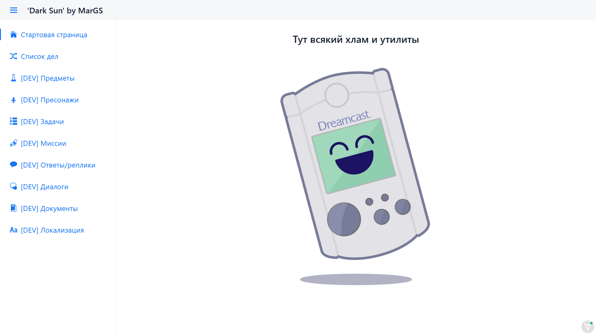

#  Dark sun



## Links
* [Docker HUB](https://hub.docker.com/repository/docker/marolok/dark_sun/general)
* [GitHub](https://github.com/PavelBocharov/DarkSun)

## Build and run
###  Start application local
1) Install min JDK8 - https://adoptopenjdk.net/
2) Install NodeJS - https://nodejs.org/en/download/
    * Install nvm - [Windows](https://github.com/coreybutler/nvm-windows), [Linux](https://github.com/nvm-sh/nvm)
3) In `Dark Sun Spring Run` edit `Environment variables` - set `dbPath` (path to SQLite db file).
4) Start `Dark Sun Spring Run` profile.
    * In root generate files for **npm**.

###  Build Docker image
1) Build production **.jar**
   ```bash 
   mvn clean install -Pproduction
   ```
2) Set DB path in [.env](./.env)
    1) `PC_DB_PATH` - your DB file
    2) `dbPath` - file in image
3) Build image
   ```bash 
   docker build --no-cache -t marolok/dark_sun:1.0.0 .
   ```
4) Set image version in [docker-compose.yml](./docker-compose.yml)
5) Start `docker-compose`
   ```bash 
   docker compose up
   ``` 
   or
   ```bash 
   docker-compose up
   ```

## Problem and fix
### NodeJS code `ERR_OSSL_EVP_UNSUPPORTED`
#### Problem:

#### Solution: Set NodeJS v16
```bash 
nvm install 16.13.1 64
```
```bash 
nvm use 16.13.1
```