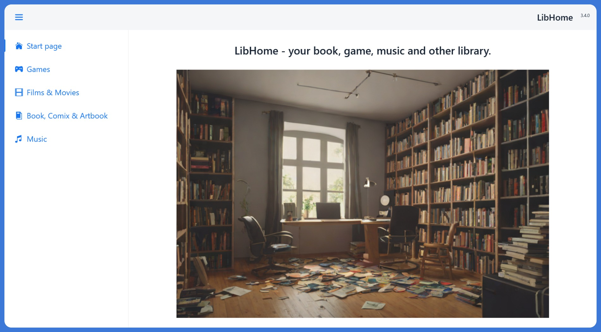

# 📖 Lib Home

## 🔗 Links

* [🛠 Build and 🚀 run](./readme_files/Start_application.md)
* [🚢 Docker HUB](https://hub.docker.com/r/marolok/lib_home)
* [♻️ GitHub](https://github.com/PavelBocharov/LibHome)
* [🚧 Problem and fix](./readme_files/Problems.md)

## 🖼 Screenshots

    
    
    
    
    

