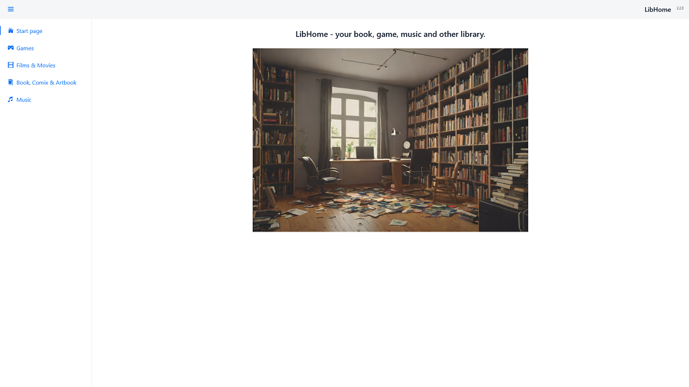
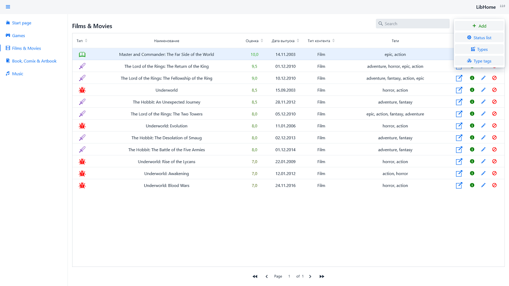
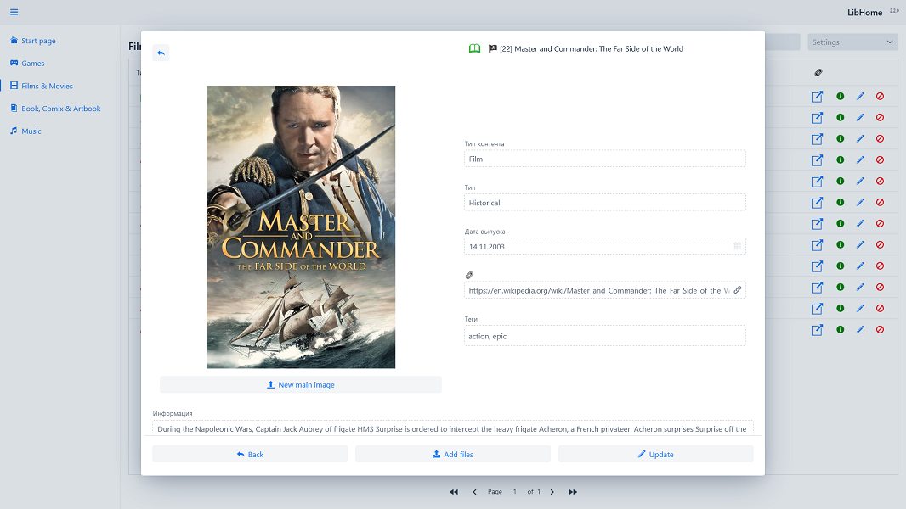
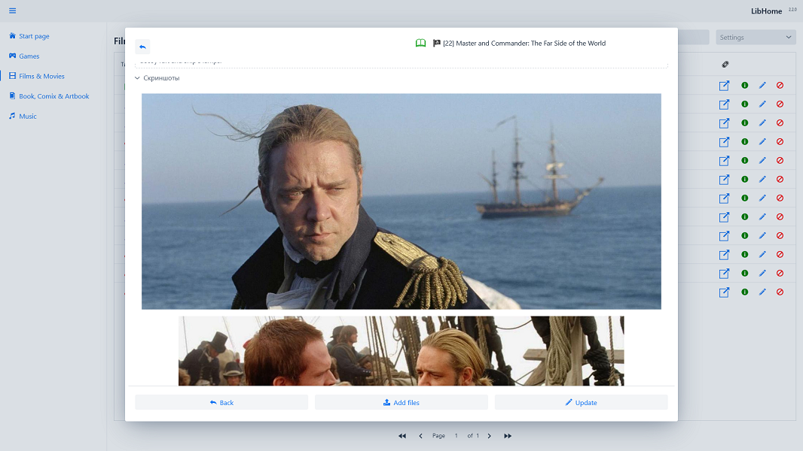
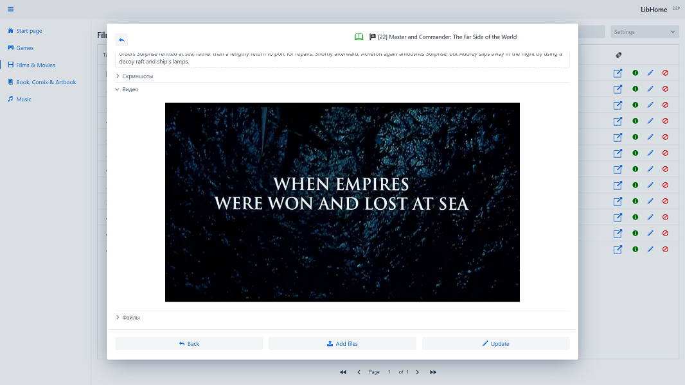

#  Lib Home



## Links

* [Docker HUB](https://hub.docker.com/r/marolok/lib_home)
* [GitHub](https://github.com/PavelBocharov/LibHome)
* [Build and run](#build-and-run)
* [Problem and fix](#problem-and-fix)

## Build and run

###  Start application local

1) Install min JDK17 - https://adoptopenjdk.net/
2) Install NodeJS - https://nodejs.org/en/download/
    * Install nvm - [Windows](https://github.com/coreybutler/nvm-windows), [Linux](https://github.com/nvm-sh/nvm)
3) Start `Spring Run` profile.
    * In root generate files for **npm**.

###  Build Docker image

1) Build production **.jar**
   ```bash 
   mvn clean install -Pproduction
   ```
2) Build image
   ```bash 
   docker build --no-cache -t marolok/lib_home:2.1.3 .
   ```
3) Push image
   ```bash 
   docker push marolok/lib_home:2.1.3
   ```
4) Set image version in [docker-compose.yml](./docker-compose.yml)
5) Start `docker-compose`
   ```bash 
   docker compose up
   ``` 
   or
   ```bash 
   docker-compose up
   ```

   > ℹ️ Info  
   > Use `-d` for daemon mode.
## Screenshots






## Problem and fix

### NodeJS code `ERR_OSSL_EVP_UNSUPPORTED`

#### Problem:


#### Solution: Set NodeJS v16

```bash 
nvm install 16.13.1 64
```

```bash 
nvm use 16.13.1
```