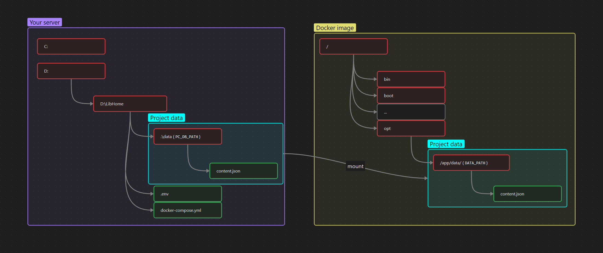

# 🛠 Build and run
* [🟢 Start application .jar](#-start-application-jar)
* [🚢 Build Docker image](#-build-docker-image)
* [🚀 Start Docker image](#-start-docker-image)

## 🟢 Start application `.jar`

1) Install JDK17 - https://adoptopenjdk.net/
   > ⚠️ Upper version crash with Lombok (tested with JDK 21).
2) Install NodeJS - https://nodejs.org/en/download/
    * Install nvm - [Windows](https://github.com/coreybutler/nvm-windows), [Linux](https://github.com/nvm-sh/nvm)
3) Set values in [application property](../src/main/resources/application.properties):
   * `app.data.content.file` - [content.json](../content.json) for UI text.
   * `app.data.path` - directory for DB, images, logs and etc.
   * `app.db.file` - SQLite database file in `app.data.path`.
4) Start `Spring Run` profile.
   > In root generate files for **npm**.

## 🚢 Build Docker image
1) Build production **.jar**
   ```bash 
   mvn clean install -Pproduction
   ```
2) Download JRE for image (min 17) - [Alpine Linux JRE 17](https://adoptium.net/temurin/releases/?os=alpine-linux&arch=x64&package=jre&version=17)
3) Save JRE archive to `./docker_files/OpenJDK*.tar.gz` - you can set in [Dockerfile](../Dockerfile)
4) Build image (set your version):
   ```bash 
   docker build --no-cache -t marolok/lib_home:3.4.0 .
   ```
5) Push image:
   ```bash 
   docker push marolok/lib_home:3.4.0
   ```

## 🚀 Start Docker image
1) PreSetting for Linux
   - Add user to docker group (`USER` - Linux login)
      ``` bash 
      sudo usermod -a -G docker USER
      ```
   - Login in Docker
      ``` bash 
      docker login --username=USER
      ```
2) Create directory with:
   * [docker-compose.yml](../docker-compose.yml) - main config with image version
   * [.env](../.env) - file with your directories, files and database.
   * [content.json](../content.json) - UI text.
3) Set image version in [docker-compose.yml](../docker-compose.yml) (remove `build` block).
4) Edit [.env](../.env):
   * `PC_DB_PATH` - directory for DB, images, logs and etc for mount - `PC_DB_PATH >> DATA_PATH`.
   

   
   * `DATA_PATH` - mount directory in **IMAGE** (default - `/opt/app/data/`).
   * `VIEW_CONTENT_JSON` - [content.json](../content.json) for UI text  (default - `/opt/app/data/content.json`)
   * `DB_FILE_IN_DATA_DIR` - SQLite database file (create in `PC_DB_PATH` & `DATA_PATH`).
5) Start `docker-compose`
   ```bash 
   docker-compose up
   ```
   > Use `-d` for daemon mode.

